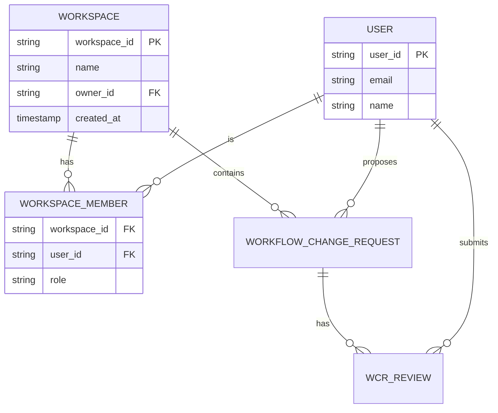

# Collaboration Data Models

This document defines the data structures for implementing team and collaboration features in n8n Ultimate.

---

## 1. Core Data Models

### Workspace
A Workspace is the top-level container for a team's resources. All users, workflows, and templates belong to a single workspace.

-   `workspace_id` (PK, string, uuid)
-   `name` (string)
-   `owner_id` (FK, references User.user_id)
-   `created_at` (timestamp)
-   `updated_at` (timestamp)

### User
Represents an individual user account.

-   `user_id` (PK, string, uuid)
-   `email` (string, unique)
-   `name` (string)
-   `password_hash` (string)
-   `created_at` (timestamp)

### WorkspaceMember
A join table linking Users to Workspaces and defining their role within that workspace.

-   `workspace_id` (FK, references Workspace.workspace_id)
-   `user_id` (FK, references User.user_id)
-   `role` (enum: 'owner', 'admin', 'editor', 'viewer')
-   `joined_at` (timestamp)

*(Primary Key: `workspace_id`, `user_id`)*

---

## 2. Role-Based Access Control (RBAC)

Roles define a set of permissions a user has within a workspace.

| Role     | Permissions                                                                   |
| :------- | :---------------------------------------------------------------------------- |
| **Owner**  | Full control. Can manage billing, delete workspace, transfer ownership.       |
| **Admin**  | Can manage users (invite/remove), manage workflows, and manage templates.     |
| **Editor** | Can create, edit, and run workflows and templates. Cannot manage users.        |
| **Viewer** | Can only view workflows and templates. Cannot make any changes.               |

---

## 3. Workflow Review System Data Models

### WorkflowChangeRequest (WCR)
Represents a "pull request" for a workflow. It captures proposed changes to a shared workflow.

-   `wcr_id` (PK, string, uuid)
-   `workspace_id` (FK, references Workspace.workspace_id)
-   `workflow_id` (string, the ID of the workflow being changed)
-   `proposer_id` (FK, references User.user_id)
-   `title` (string)
-   `description` (text)
-   `status` (enum: 'open', 'approved', 'rejected', 'merged')
-   `proposed_workflow_json` (json)
-   `created_at` (timestamp)
-   `updated_at` (timestamp)

### WCR_Review
Represents a review left by a team member on a Change Request.

-   `review_id` (PK, string, uuid)
-   `wcr_id` (FK, references WorkflowChangeRequest.wcr_id)
-   `reviewer_id` (FK, references User.user_id)
-   `state` (enum: 'approved', 'request_changes', 'comment')
-   `comment` (text)
-   `created_at` (timestamp)

---

## 4. Entity Relationship Diagram (ERD)

