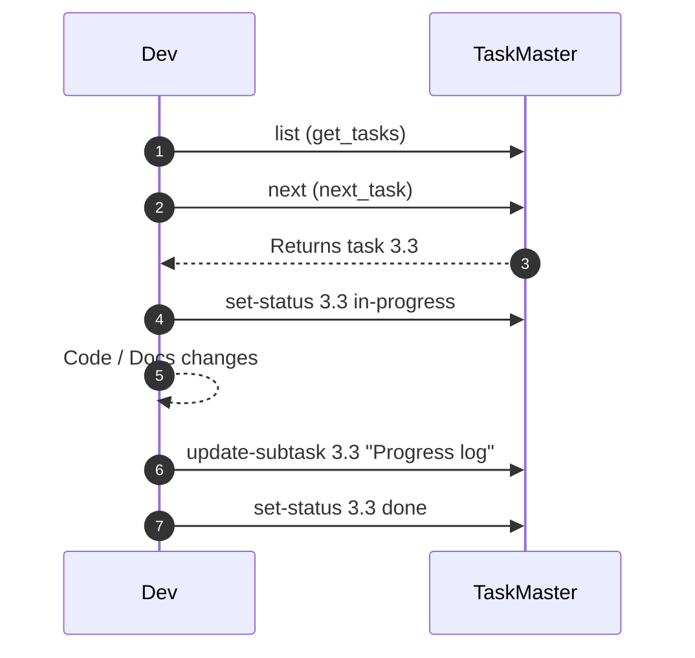

# Developer Workflow Guide (Validators + Task Master)

> **Audience:** Contributors and AI agents writing or reviewing code for _n8n Ultimate_
>
> **Last Updated:** <!-- timestamp placeholder -->

---

## 1. Local Environment Setup

1. `git clone git@github.com:your-org/n8n-ultimate.git`
2. `cd n8n-ultimate && npm install`
3. Start **Ollama** (for local models):
   ```bash
   ollama serve &> /dev/null &
   ```
4. Create `.env` (API keys if using cloud models)
5. Run type-check & unit tests once:
   ```bash
   npm run build && npm test
   ```

---

## 2. Task Master–Driven Development Cycle



### Key Commands

| Action | MCP Tool | CLI Equivalent |
|--------|----------|---------------|
| View tasks | `get_tasks` | `task-master list` |
| Find next task | `next_task` | `task-master next` |
| Start work | `set_task_status --status=in-progress` | `task-master set-status` |
| Log progress | `update_subtask` | `task-master update-subtask` |
| Mark done | `set_task_status --status=done` | `task-master set-status` |

> **Tip:** Use tags to avoid merge conflicts when on feature branches: `task-master add-tag --from-branch`.

---

## 3. Using Validators Before Commit

1. **Static validation:**
   ```bash
   node run-validation.ts --file workflows/my-workflow.json
   ```
2. **Real-world test:**
   ```bash
   node src/testing/real-world-testing-framework.ts --workflow workflows/my-workflow.json
   ```
3. **Performance smoke test:**
   ```bash
   node src/performance/performance-monitor.ts --workflow workflows/my-workflow.json
   ```
4. Record results:
   ```bash
   mcp_task-master-ai_update_subtask --id=<id> --prompt="Validation passed ✔️"
   ```

Validators will fail the CI job (`npm run ci`) if any errors remain.

---

## 4. Testing Strategy

* **Unit tests** live next to code (`test-*.ts`).  Run with `npm test`.
* **Integration tests** in `src/testing/`.  Use synthetic inputs or sample workflows.
* **Performance tests** in `src/performance/` to safeguard memory/CPU budgets.
* **End-to-End (E2E) tests** for key user flows. Run with `npm run e2e`. See the [E2E Test Plan](E2E_TEST_PLAN.md) for full details.

---

## 5. Commit & PR Checklist

- [ ] All validators pass locally
- [ ] `npm test` green
- [ ] Documentation updated (`docs/`)
- [ ] Task Master subtasks/logs updated
- [ ] No linter errors (`npm run lint`)

```bash
# Example commit
git add .
git commit -m "docs: add workflow validation & developer guide (task 3.3, 3.4)"
```

---

## 6. CI Pipeline Overview

GitHub Actions workflow `.github/workflows/ci.yml` runs:
1. `npm ci`
2. `npm run lint`
3. `npm test`
4. `node run-validation.ts --all-workflows`
5. **Fail PR** if any step fails

---

## 7. Debugging Tips

* If **Ollama** fails, restart via `ollama serve`.
* Use `NODE_OPTIONS=--max-old-space-size=4096` for large workflows.
* Check `.taskmaster/logs/` for AI agent progress.
* `npm run dev:watch` rebuilds TypeScript on save.

---

_For questions ping `#dev-support` on Slack or open a Task Master ticket._ 