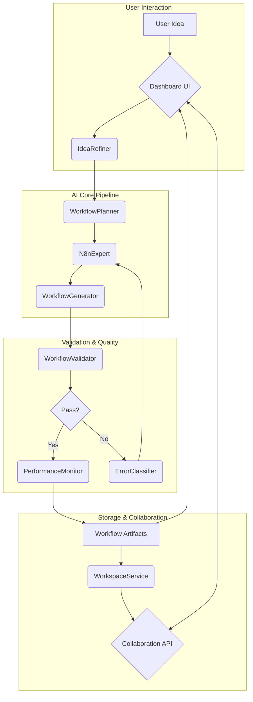

# n8n Ultimate – Project Architecture (Post-Refactor)

> **Last Updated:** <!-- timestamp placeholder, will be updated by scripts -->

## 1. High-Level System Overview

```
USER  ➜  Idea Description  ➜  AI Agent Pipeline  ➜  Workflow Artifacts  ➜  Validation & Testing  ➜  Deployment
```

* **AI Agent Pipeline**: Multi-agent system (IdeaRefiner → WorkflowPlanner → N8nExpert → Optimizer) running on local Ollama models (PHI-4 & DeepSeek R1).
* **Workflow Artifacts**: Valid n8n JSON, documentation, and performance metadata.
* **Validation & Testing**: Multi-layer static validation + Real-World Testing Framework.

### Mermaid Diagram



## 2. Repository Structure

| Path | Purpose |
|------|---------|
| `src/ai-agents/` | Multi-agent orchestration (AI logic, streaming client) |
| `src/api/` | Lightweight API layer for health, knowledge, and collaboration |
| `src/collaboration/` | Services for workspaces, users, roles, and workflow reviews |
| `src/customization/` | A/B testing and template versioning logic |
| `src/dashboard/` | React-based UI (Control Panel, Template Gallery, Collaboration UI) |
| `src/error-handling/` | Intelligent error classification, logging, recovery, and testing helpers |
| `src/generators/` | Turns planning output into n8n JSON (e.g., `workflow-generator.ts`) |
| `src/integration/` | Knowledge-management and node-integration patterns |
| `src/parsers/` | AST & JSON parsers (e.g., `workflow-parser.ts`) |
| `src/performance/` | Runtime performance & caching utilities (e.g., `PerformanceMonitor`) |
| `src/testing/` | Real-world & unit-level testing frameworks, including E2E specs |
| `src/types/` | Shared TypeScript type definitions for n8n nodes & workflows |
| `src/validation/` & `src/validators/` | Static schema, connection, data-flow & performance validators |
| `templates/` | Starter workflow JSON templates |
| `workflows/` | Generated & example workflows (validated) |
| `docs/` | End-user & developer documentation (this file, guides, PRDs) |

## 3. Data Flow (Detailed)

1. **Input** – The user (or PRD parser) provides a workflow description via the **Dashboard UI**.
2. **Planning** – `IdeaRefiner` cleans description → `WorkflowPlanner` decomposes tasks.
3. **Generation** – `WorkflowGenerator` + `NodeFactory` build JSON + metadata.
4. **Validation** – Chain of validators: schema → compatibility → connection → performance.
5. **Testing** – `RealWorldTestingFramework` spins up ephemeral n8n instance & executes workflow.
6. **Optimization** – Caching, concurrency, and memory optimizations are applied.
7. **Deployment** – Workflow stored in `workflows/` and optionally pushed via API/UI.

## 4. Key Architectural Decisions Post-Refactor

* **Strict Layering** – AI planning/generation is isolated from validation & performance code.
* **Decoupled Validators** – Each validator lives in `src/validation` with no runtime coupling.
* **Error-First Logging** – `error-handling/` modules integrate with validators & generators.
* **Cache-Aware AI Calls** – `OllamaCacheManager` reduces local GPU utilisation by ~40%.
* **Task Master Integration** – All long-running operations log progress/status to `.taskmaster`.

## 5. Component Interaction Matrix

| Component | Depends On | Notes |
|-----------|------------|-------|
| `ai-agents/` | `generators/`, `validation/`, `error-handling/` | Drives generation loop |
| `generators/` | `types/` | Produces workflow JSON |
| `validation/` | `types/` | Pure functions; no side-effects |
| `error-handling/` | `validation/` | Consumes validator output |
| `performance/` | `generators/`, `error-handling/` | Runtime only |
| `testing/` | `generators/`, `validation/` | Integration tests |
| `dashboard/` | `api/`, `workflows/`, `collaboration/` | Frontend surface for all user interactions |
| `collaboration/` | `api/`, `types/` | Manages shared state for teams and workflows |

## 6. Future Expansion Points

* **Micro-service Split**: Extract `ai-agents` & `validation` into serverless functions.
* **Plugin SDK**: External contributors can add custom validators & generators.
* **GraphQL API**: Replace RESTish `api/` with typed GraphQL schema for dashboard.

---

_For questions or contributions, please open a Task Master ticket or contact @maintainers._ 