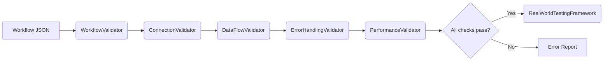

# Workflow Validation & Error-Handling Guide

> **Audience:** Workflow builders, QA engineers, and AI agents involved in generating or reviewing n8n workflows.
>
> **Last Updated:** <!-- timestamp placeholder -->

---

## 1. Why Validation Matters

A valid workflow saves countless debugging hours and safeguards your automation from silent failures. Our **multi-layer validator stack** ensures every generated workflow:

* Conforms to the n8n JSON schema
* Uses compatible node versions
* Maintains data-flow integrity
* Meets performance & memory budgets
* Implements graceful error handling

---

## 2. Validation Pipeline Overview



| Validator | Location | Responsibility |
|-----------|----------|----------------|
| `WorkflowValidator` | `src/validators/` | Schema + basic compatibility (core validator) |
| `ConnectionValidator` | `src/validation/` | Ensures each node's inputs/outputs align (extended validator) |
| `DataFlowValidator` | `src/validation/` | Detects type mismatches / undefined fields (extended validator) |
| `ErrorHandlingValidator` | `src/validation/` | Confirms try/catch or IF-based guards exist (extended validator) |
| `PerformanceValidator` | `src/validation/` | Estimates RAM / exec-time budgets (extended validator) |

---

## 3. Running Validators Locally

### 3.1 Quick Validation Script

```bash
# Validate a single workflow file from the project root
node run-validation.ts --file workflows/hubspot-mixpanel-integration.json
```

The script gathers all validators above, prints a consolidated report, and exits non-zero if any check fails.

### 3.2 Validator-by-Validator

```bash
# Schema & compatibility only
node src/validators/workflow-validator.ts --file <file>

# Check connections
node src/validation/connection-validator.ts --file <file>
```

> **Tip:** Integrate these commands into your CI pipeline using the provided `docs/CI.MD` examples.

---

## 4. Real-World Testing Framework

Passing static validators is **necessary but not sufficient**. The `RealWorldTestingFramework` spins up a headless n8n instance, imports the workflow, triggers sample executions, and reports runtime errors.

```bash
node src/testing/real-world-testing-framework.ts --workflow workflows/my-workflow.json
```

* Uses Dockerised n8n by default (`--docker-image` flag)
* Supports synthetic data via `--mock-input` JSON files
* Generates an HTML coverage report in `.taskmaster/reports/`

---

## 5. Error-Handling Patterns

### 5.1 Field-Name Consistency (Most Common Failure)

```
// ✅ DO
customer_id
mixpanel_customer_id

// ❌ DON'T
CustomerID
customerId
```

### 5.2 Guard Clauses with **IF** Nodes

* Validate external API responses
* Short-circuit when required fields are empty

### 5.3 Graceful Degradation with **Error Classifier**

```typescript
import { ErrorClassifier } from "../error-handling/error-classifier";

try {
  await performOperation();
} catch (err) {
  ErrorClassifier.handle(err, { workflow: "HubSpot→Mixpanel" });
}
```

### 5.4 Adaptive Error Collector

Aggregates non-fatal errors for later inspection without interrupting the workflow.

---

## 6. Troubleshooting Checklist

1. **Schema Errors** → Run `WorkflowValidator` → fix node properties.
2. **Connection Failures** → Run `ConnectionValidator` & verify node input names.
3. **Undefined Data** → Add IF guards & verify expression paths.
4. **Performance Warnings** → Use smaller batch sizes or enable cache nodes.
5. **Runtime Exceptions** → Reproduce with `RealWorldTestingFramework` and inspect logs.

---

## 7. Integrating with Task Master

* **During development**: Log validation results via:

```bash
mcp_task-master-ai_update_subtask --id=<subtask> --prompt="Validation pass ✅"
```

* **CI/CD**: Block merges if `run-validation.ts` exits non-zero.
* **Post-mortems**: Attach error reports to Task Master subtasks for future learning.

---

## 8. Further Reading

* [n8n Workflow Debugging Guide](./N8N_WORKFLOW_DEBUGGING.md)
* A deeper look at the [Error-Handling Modules](../src/error-handling/).
* The implementation of the [Real-World Testing Framework](../src/testing/real-world-testing-framework.ts).

---

*Happy automating!* 